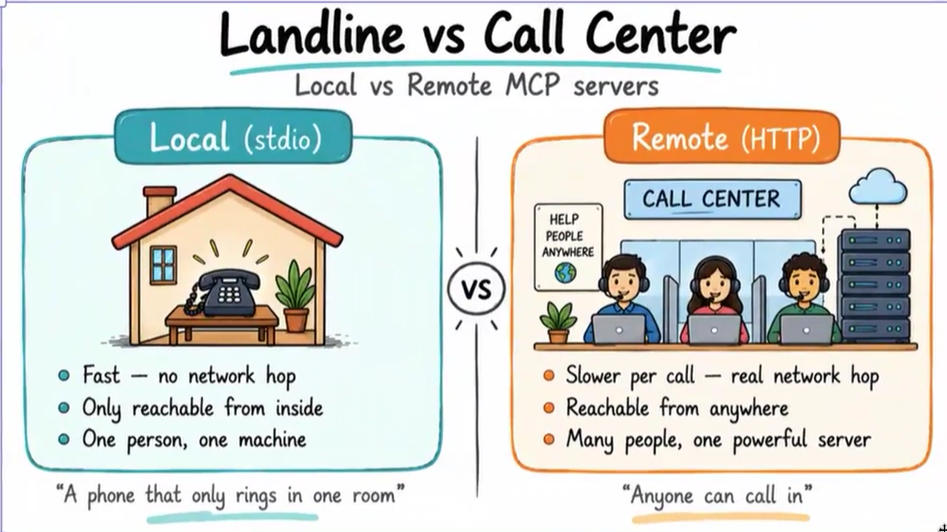
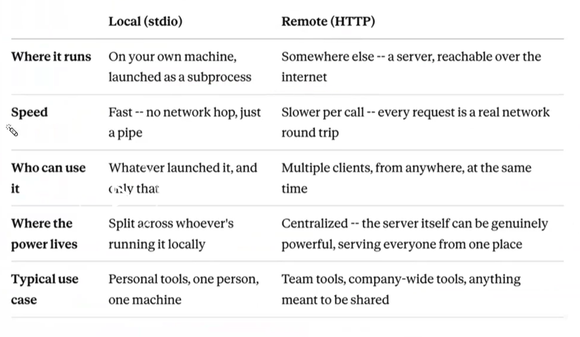

# TimeTrack MCP Server

TimeTrack is one Python process with **two doors onto the same SQLite database**:

1. A **browser website** at `/` — people log and review hours.
2. An **MCP server** at `/mcp` — AI assistants log and review the same hours.

Both doors call the same functions in `database.py`. A row logged from Claude or Cursor shows up in the website table. A row logged in the browser shows up when the assistant calls `get_timesheet`.

## Local (stdio) vs remote (HTTP)

This app uses **remote Streamable HTTP** at `/mcp`, so more than one client can share one timesheet. A local stdio server is a subprocess on your machine; an HTTP server is a network endpoint.



| | Local (stdio) | Remote (HTTP) |
|---|---|---|
| Where it runs | On your machine, launched as a subprocess | A server reachable over the network |
| Who can use it | Only the process that launched it | Multiple clients at once |
| Typical use | Personal tools, one machine | Shared team tools |



## Prerequisites

- Python 3.13+
- [uv](https://docs.astral.sh/uv/)
- A browser
- Optional: an MCP client (Claude Desktop, Cursor, or `uv run fastmcp dev`)

## Setup

```bash
uv sync
```

On Windows, point SQLite at a real path (the default `/tmp/timetrack.db` is a Linux/macOS convention):

```powershell
$env:TIMETRACK_DB_PATH = ".\timetrack.db"
```

## Run

Production app (website + MCP on one port):

```bash
uv run uvicorn main:app --reload --host 127.0.0.1 --port 8000
```

| URL | Door |
|---|---|
| http://127.0.0.1:8000 | Website |
| http://127.0.0.1:8000/docs | Swagger for REST |
| http://127.0.0.1:8000/mcp | MCP Streamable HTTP |

Learning file (REST first, then `FastMCP.from_fastapi` — not the production design):

```bash
uv run uvicorn main_to_understand:app --port 9998 --reload
```

Swagger: http://127.0.0.1:9998/docs

STDIO MCP server (Inspector / `fastmcp run`):

```bash
uv run fastmcp run .\main_to_understand.py
```

## Connect an MCP client

Claude Desktop / Cursor config for the running HTTP server:

```json
{
  "mcpServers": {
    "timetrack": { "url": "http://127.0.0.1:8000/mcp" }
  }
}
```

Restart the client after saving. Then:

1. Ask it to list projects — it should call `list_projects`.
2. Log hours through the assistant, then refresh the website **All Entries** tab.
3. Log hours in the browser, then ask for that employee's timesheet.

Both doors must see the same rows. That is the point of the project.

## MCP surface (production `main.py`)

| Kind | Name | Role |
|---|---|---|
| Tool | `log_time` | Insert a time entry |
| Tool | `get_timesheet` | Entries for one employee, optional date range |
| Tool | `get_project_summary` | Hours by employee for one project |
| Tool | `list_projects` | Distinct project names |
| Resource | `timesheet://projects` | Current project names for consistent spelling |
| Prompt | `generate_weekly_report` | Recipe: call `get_timesheet`, group by project, do not invent hours |

Hand-curated tools are the production pattern. `main_to_understand.py` auto-wraps REST and also exposes raw SQL — useful for study, unsafe to ship.

## Repository map

```
time-track-mcp-server-application/
├── main.py                 Production app: MCP first, then FastAPI, then mounts
├── database.py             SQLite persistence and queries
├── dummy.py                Minimal MCP-only calculator (Horizon deploy example)
├── main_to_understand.py   Learning file: REST first, then FastMCP.from_fastapi
├── static/                 Three-tab vanilla UI
├── assets/                 Local vs remote MCP diagrams
├── docs/
│   ├── ARCHITECTURE.md
│   ├── LEARNING_AND_REBUILD.md
│   ├── MAIN_TO_UNDERSTAND.md
│   └── main-to-understand.html
└── pyproject.toml
```

Two mounting rules that break `/mcp` if you get them wrong:

1. `mcp.http_app(path="/")` — not `"/mcp"`. `app.mount("/mcp", mcp_app)` already adds the prefix.
2. Pass `lifespan=mcp_app.lifespan` into `FastAPI(...)` at construction, not later.

## Learn more

- [Application architecture](docs/ARCHITECTURE.md) — process shape, schema, REST, MCP, request flows
- [Learn it, then build it again](docs/LEARNING_AND_REBUILD.md) — rebuild from an empty folder, with checkpoints
- [`main_to_understand.py` walkthrough](docs/MAIN_TO_UNDERSTAND.md) — REST first, `from_fastapi`, startup trap, quiz ([HTML](docs/main-to-understand.html))
