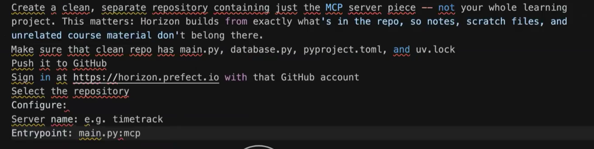

# How to host your MCP server remotely

Prefect Horizon (FastMCP Cloud). Sign in at [https://horizon.prefect.io](https://horizon.prefect.io/).
Build rules: [Horizon build system](https://docs.horizon.prefect.io/platform/build-system).

Source slide: [assets/steps-to-remote-mcp.png](../assets/steps-to-remote-mcp.png).



---

## Keep learning files in *this* git

This repo is the course project. **Do not delete** `docs/`, `assets/`, `static/`, or `main_to_understand.py` to make Horizon happy. They stay committed.

Horizon checks out the GitHub commit, then **installs one dependency file** and **imports one entrypoint**. Unused markdown and PNGs sit in the checkout; they are not the running server.

| Horizon field | Value | Why |
|---|---|---|
| Repository | this GitHub repo | learning files stay here |
| Server name | `timetrack` | becomes the public host name |
| Entrypoint | `mcp_server.py:mcp` | FastMCP only — no FastAPI, no `./static` |
| Dependency file | `requirements-horizon.txt` | installs `fastmcp` only |

Do **not** set the entrypoint to `main.py:mcp`. Importing `main.py` builds the website, mounts `StaticFiles`, and needs FastAPI.

Do **not** leave the dependency file blank. Horizon then walks from the entrypoint folder and picks the first of `requirements.txt` → `uv.lock`+`pyproject.toml` → `pyproject.toml`. Root `requirements.txt` also installs FastAPI and uvicorn, which Horizon does not need.

Optional env var on the Horizon server: `TIMETRACK_DB_PATH` (SQLite file path). Default is `timetrack.db` next to the code. That disk is not a durable volume unless Horizon says so — seed data may reset when the instance is replaced.

After deploy, paste the public URL (typically `https://timetrack.fastmcp.app/mcp`) into Cursor / Claude Desktop. That door is MCP only. The website stays on local `uvicorn main:app`.

---

## Slide steps (same idea)

1. This learning repo is fine as the GitHub source. The *running* piece is `mcp_server.py` + `database.py` + `requirements-horizon.txt`.
2. Those three files must stay at the repo root (same folder as `uv.lock` is optional for Horizon if you set the dependency file explicitly).
3. Push to GitHub.
4. Sign in at [https://horizon.prefect.io](https://horizon.prefect.io/) with that GitHub account.
5. Select this repository.
6. Configure:

   | Field | Value |
   |---|---|
   | Server name | `timetrack` |
   | Entrypoint | `mcp_server.py:mcp` |
   | Dependency file | `requirements-horizon.txt` |

Horizon handles HTTPS, `/mcp`, and the public URL.

---

## What Horizon actually packages

From the [build system](https://docs.horizon.prefect.io/platform/build-system):

- It inspects the entrypoint with FastMCP. Import-time side effects fail the build.
- `main.py` mounts `./static` at import time — that is why it is not the entrypoint.
- Large unused files only slow the clone. They do not become tools.

What Horizon **runs**:

```text
mcp_server.py  →  database.py  →  SQLite
```

What stays in git for you, not for the public MCP process:

```text
docs/   assets/   static/   main.py   main_to_understand.py
mcp_http_connector/   LEARNING_*.md
```

---

## Optional later: a second tiny GitHub repo

The slide’s “clean separate repository” is only needed if you want Horizon’s clone itself to be four files. You can `git subtree` or copy:

- `mcp_server.py` (rename to `main.py` if you like, then entrypoint `main.py:mcp`)
- `database.py`
- `requirements-horizon.txt` (or a slim `pyproject.toml` + `uv.lock`)

This learning repo stays the place with notes and diagrams. Do that split only if clone size or “exactly what’s in the repo” becomes a problem. Same-repo + the table above is enough for class.

For a calculator-only smoke test with no database, a smaller entrypoint would be a dedicated `dummy.py:mcp`. See [LEARNING_AND_REBUILD.md](LEARNING_AND_REBUILD.md) Phase 9–10 and [ARCHITECTURE.md](ARCHITECTURE.md) (Prefect Horizon).
